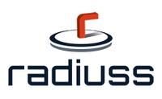

# Radiuss Logo

This project is part of [RADIUSS](https://computing.llnl.gov/projects/radiuss), which
has a focus on helping open source scientific projects use best practices for
automation and development.

This is a playground for experimenting with different RADIUSS logos, and keeping
track of source files. None of these are final or decided, this is simply a place to
work and discuss ideas! The logos are organized by folder, and detailed in the repository
README here.

## RADIUSS

The original base logo for RADIUSS is the following:

It wasn't clear to me at first glance that the red wrench was in fact an R!
It would be good to get the original source files and color palette to keep here.

## Compass Design

I decided to give a shot at a flatter design, and one that we could remove
the central part and put a project specific logo inside and it would still
hint at RADIUSS. For this first effort, I tried doing a compass using the
same colors as the original logo:

This could be improved I think, maybe with letters as the directions instead
of lines? I created several variations.

## Docker

For the docker images repository (and other Docker realted projects) I tried a
design that would "hint" at RADIUSS but not explicitly use the same design.

I'm still thinking about other designs and don't see these as being anything
final. If you have suggestions or ideas, please [open an issue](https://github.com/rse-radiuss/logo/issues/).

License
-------

Copyright (c) 2017-2021, Lawrence Livermore National Security, LLC. 
Produced at the Lawrence Livermore National Laboratory.

RADIUSS Docker is licensed under the MIT license [LICENSE](./LICENSE).

Copyrights and patents in the RADIUSS Docker project are retained by
contributors. No copyright assignment is required to contribute to RADIUSS
Docker.

This work was produced under the auspices of the U.S. Department of
Energy by Lawrence Livermore National Laboratory under Contract
DE-AC52-07NA27344.
